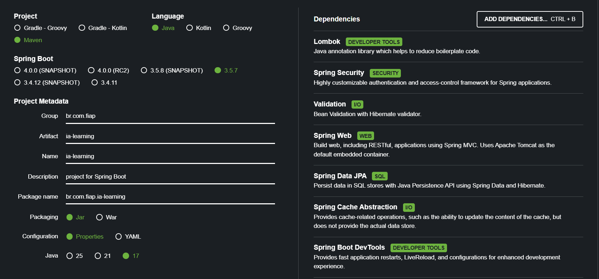

# 📚 IA-Learning

Uma plataforma inteligente criada para analisar e demonstrar, na prática, o impacto da Inteligência Artificial no futuro do trabalho.

## 🧠 Ideia do Projeto

O IA-Learning foi desenvolvido dentro do tema “O Futuro do Trabalho”, buscando responder à pergunta:
Como a Inteligência Artificial pode prejudicar, transformar ou substituir profissões nos próximos anos?
Nosso objetivo foi criar uma IA amigável, educativa e responsável, capaz de:

Auxiliar no entendimento de conteúdos

Sugerir materiais de estudo

Avaliar tarefas e respostas

Explicar temas complexos em diferentes níveis de profundidade

A proposta é mostrar como a IA pode ser utilizada como ferramenta de aprendizado, e não como ameaça.

---
## 👨‍💻 Integrantes

- Caroline Assis Silva - RM 557596  
- Enzo de Moura Silva - RM 556532  
- Luis Henrique Gomes Cardoso - RM 558883  

---

## ⚙️ Tecnologias Utilizadas

☕ Java 17

🌱 Spring Boot

🔐 Spring Security + UserDetailsService

🧠 Spring AI + OpenAI API

🗃 MySQL

📘 Swagger / OpenAPI

🌍 i18n Internacionalização

⚙️ Arquitetura MVC

---

## 🐳 Banco de Dados com Docker

Para subir o banco de dados MySQL, utilizamos o Docker. O comando usado foi:

```bash
docker run --name ialearning-db ^
  -e MYSQL_ROOT_PASSWORD=1234 ^
  -e MYSQL_DATABASE=ialearning ^
  -e MYSQL_USER=iauser ^
  -e MYSQL_PASSWORD=1234 ^
  -p 3306:3306 ^
  -d mysql:8.0
```

2. Criar a variável de ambiente da OpenAI
  
 ```bash
  setx OPENAI_API_KEY ""
 ```

## 🧪 Como Executar o Projeto

1. Clone o repositório:

```bash
git clone https://github.com/codecrazes/ia-learning-JAVA.git
```
Subir o banco com Docker:

```bash
docker start ialearning-db
```
(caso ainda não tenha criado, usar o comando completo mostrado acima)

Rodar a aplicação:
```bash
mvn spring-boot:run
```

## 🌐 Documentação da API

Swagger disponível em:

[http://localhost:8080/swagger-ui/index.html](http://localhost:8080/swagger-ui/index.html)

## 🔄 Exemplos de Requisições (JSON para Teste)

### Usuario

```bash
{
  "nome": "Jose Bezerra",
  "email": "jose@gmail.com",
  "senha": "1234",
  "profissao": "dev"
}
```
### Login

- **Usuário:** `jose@gmail.com`  
- **Senha:** `1234`

### IA
```bash
{
  "nome": "EcoIA",
  "descricao": "IA para recomendações sustentáveis",
  "tipo": "sustentavel",
  "ecoScore": 92
}
```

### Tarefa
```bash
{
  "titulo": "Estudar Spring Security",
  "descricao": "Preciso aprender como configurar roles e autenticação na API.",
  "dificuldade": "medio",
  "tempoDisponivel": 60,
  "usuarioId": 1
}
```

### Avaliação

```bash
{
  "nota": 5,
  "comentario": "Muito boa",
  "usuarioId": 1,
  "iaId": 1
}
```
## Configuração Inicial no Spring Initializr com dependências.


